# <p align="center"> <a id="id99"> :cloud: AWS Cloud Practitioner :cloud: </p>
<p align="center"> 💻 Atualizado em 21 de Agosto de 2023 💻</p>

Repositório destinado a anotações de estudo para a prova de certificação **AWS Cloud Practitioner (CLF-C01)**.

## :pushpin: Sumário
[Introdução](#id1)&nbsp;&nbsp;&nbsp;|&nbsp;&nbsp;&nbsp;
[Tipos de Serviços Cloud](#id2)&nbsp;&nbsp;&nbsp;|&nbsp;&nbsp;&nbsp;
[Infraestrutura Global AWS](#id3)&nbsp;&nbsp;&nbsp;|&nbsp;&nbsp;&nbsp;
[Segurança e AWS IAM](#id4)&nbsp;&nbsp;&nbsp;|&nbsp;&nbsp;&nbsp;
[EC2](#id5)&nbsp;&nbsp;&nbsp;|&nbsp;&nbsp;&nbsp;
[Auto Scaling Group](#id6)&nbsp;&nbsp;&nbsp;|&nbsp;&nbsp;&nbsp;
[AWS Lambda](#id7)&nbsp;&nbsp;&nbsp;|&nbsp;&nbsp;&nbsp;

## <a id="id1">:page_facing_up: Introdução </a>
[INÍCIO](#id99)

Cloud Computing é a entrega sob demanda (On Demand) de recursos de computação, banco de dados, armazenamento, aplicações ou qualquer outro recurso de tecnologia que é entregue através de uma plataforma via internet, onde o pagamento é baseado no consumo (pay-as-you-go). Em vez de comprar, ter e manter datacenters e servidores físicos, você pode acessar serviços de tecnologia, como capacidade computacional, armazenamento e bancos de dados, conforme a necessidade, usando um provedor de nuvem como a Amazon Web Services (AWS).

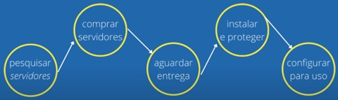
<br>Fluxo de uma empresa sem a utilização dos serviços Cloud.

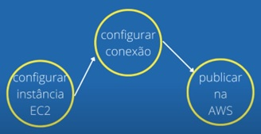
<br>Fluxo com Cloud Computing.

### Vantagens do uso de Cloud Computing

1. **Você Troca CAPEX (Capital Expense) por OPEX (Operational Expense)** - Significa que você não se preocupa mais com o hardware, apenas com as questões operacionais da sua aplicação.
2. **Economias de escala.** - Significa que seu gasto está totalmente adaptado ao seu consumo, não existe ociosidade, nem sobrecarregamento.
3. **Pare de adivinhar sua capacidade** - Significa que com a cloud você pode utilizar de ferramentas e métricas para saber com mais exatidão qual será seu gasto com infra.
4. **Aumente a sua velocidade e agilidade** - Significa que com a cloud você terá vários impedimentos a menos para ter um desenvolvimento mais ágil, com entregas mais curtas rápidas e contínuas.
5. **Pare de gastar dinheiro rodando e mantendo data centers** - Agora quem mantém os datacenters é a AWS, você cuida apenas do contexto do seu negócio. Ao invés de investir em servidores, você paga apenas quando consumir um recurso e apenas pela quantidade que consumir.
6. **Torne-se global em minutos** - A infra e as ferramentas da AWS permitem que em alguns minutos você publique uma aplicação completa disponível para clientes no mundo todo.

<details>
  <summary><strong><h3> Planos de Suporte </h3></strong></summary>

Existem cinco (05) planos de suporte na AWS:
```bash
1. Basic (gratuito);
2. Developer;
3. Business;
4. Enterprise On-Ramp;
5. Enterprise.
```

O objetivo é entender a diferença de cada plano de suporte e conseguir sugerir o melhor plano, segundo as requisições de um cliente. Essas requisições podem ser sobre obter um plano com menor SLA (Service Level Agreement ou Acordo de Nível de Serviço), ter suporte a terceiros e até a quantidade de pessoas que podem abrir um chamado na AWS.

**BASIC**
- Custo: Grátis;
- Recomendado para quem está conhecendo a AWS;
- Serviços de nível gratuito que não expiram e serviços com 12 meses gratuitos;
- Suporte limitado para serviços da conta e perguntas sobre cobranças;
- Acesso na comunidade AWS (Fórum).

**DEVELOPER**
[tudo do nível anterior]
- Custo: Mais de 29 USD/mês ou % do uso mensal (o que for maior);
- Recomendado para quem está experimentando a AWS;
- AWS Trusted Advisor: Possui sete verificações principais;
- Suporte: Por e-mail, em horário comercial, sendo um contato primário, que pode abrir múltiplos tickets de suporte;
- Orientação arquitetura: Geral.

**BUSINESS**
[tudo do nível anterior]
- Custo: Mais de 100 USD/mês ou % do uso mensal (o que for maior);
- Recomendado se você tem cargas de trabalho no nível de produção;
- AWS Trusted Advisor: Acesso completo;
- Suporte: Por telefone, e-mail e chat 24x7, possuindo um número de contatos ilimitados, que podem abrir múltiplos tickets de suporte;
- SLA: Até 1 hora para casos de sistema de produção inativo;
- Orientação arquitetura: Contextual em relação ao seus casos de uso;
- Suporte de API no AWS Support;
- Suporte a software de terceiros: orientações de interoperabilidade.

**ENTERPRISE ON-RAMP**
[tudo do nível anterior]
- Custo: Mais de 5.500 USD/mês ou % do uso mensal (o que for maior);
- Recomendado se você tem cargas de trabalho que são essenciais;
- SLA: Até 30 minutos para casos de sistema essencial inativo;
- Orientação arquitetura: Revisão consultiva;
- Não é um TAM, mas sim um grupo de gerentes da AWS que analisam o seu; caso e lhe indicam um programa ou um parceiro especialista AWS;
- Contato com equipe Concierge: Suporte que auxilia análise das contas e faturas.

**ENTERPRISE**
[tudo do nível anterior]
- Custo: Mais de 15.000 USD/mês ou % do uso mensal (o que for maior);
- Recomendado se você tem cargas de trabalho no nível missão crítica;
- SLA: Até 15 minutos para casos de sistema crítico inativo;
- Contato com um Technical Account Manager (TAM): Gerente proativo que direciona as melhores práticas e ajuda no desenvolvimento e execução de soluções AWS;
- Contato com equipe Concierge: Suporte que auxilia análise das contas e faturas;
- Acesso a laboratórios autoguiados online.

|  | BASIC | DEVELOPER | BUSINESS | ENTERPRISE <br>ON-RAMP | ENTERPRISE |
|--- |--- |--- | --- | --- | --- |
| <div align="center">**Próprio**</div> | <div align="center">Iniciantes</div> | Experimentação | <div align="center">Produção</div> | <div align="center">Essencial</div> | <div align="center">Missão crítica</div> |
| <div align="center">**AWS Trusted Advisor**</div> | <div align="center">7 itens</div> | <div align="center">7 itens</div> | **Acesso completo** | **Acesso completo** | **Acesso completo** |
| <div align="center">**Suporte**</div> | <div align="center">Documentação, <br>Whitepaper e fóruns</div> | <div align="center">e-mail</div> | telefone, e-mail e <br>chat 24x7 | telefone, e-mail e <br>chat 24x7 | telefone, e-mail e <br>chat 24x7 |
| <div align="center">**Abrir Case**</div> | <div align="center">Dúvidas conta, <br>cobrança, <br>aumentar limite do serviço <br>(**sem suporte técnico**)</div> | <div align="center">1 Pessoa</div> | **Múltiplas pessoas** | **Múltiplas pessoas** | **Múltiplas pessoas** |
| <div align="center">**SLA**</div> | <div align="center">-</div> | <div align="center">Até **24 horas** <br>horário comercial</div> | <div align="center">Até **1 hora** para <br>sistema <br>de produção inativo</div> | <div align="center">Até **30 minutos** para <br>sistema <br>essencial inativo</div> | <div align="center">Até **15 minutos** para <br>sistema <br>crítico inativo</div> |
| <div align="center">**Suporte Terceiros**</div> | <div align="center">-</div> | <div align="center">-</div> | <div align="center">**orientações de <br>interoperabilidade**</div> | <div align="center">**orientações de <br>interoperabilidade**</div> | <div align="center">**orientações de <br>interoperabilidade**</div> |
| <div align="center">**Concierge**</div> | <div align="center">-</div> | <div align="center">-</div> | <div align="center">-</div> | <div align="center">**SIM**</div> | <div align="center">**SIM**</div> |
| <div align="center">**Orientação Arquitetura**</div> | <div align="center">-</div> | <div align="center">-</div> | <div align="center">-</div> | <div align="center">**SIM**</div> | <div align="center">**SIM**</div> |
| <div align="center">**TAM - Technical <br>Account Manager**</div> | <div align="center">-</div> | <div align="center">-</div> | <div align="center">-</div> | <div align="center">**Grupo de gerentes <br>TAM, que indicam <br>programas e <br>especialistas AWS**</div> | <div align="center">**SIM**</div> |
</details>

## <a id="id2">:open_umbrella: Tipos de serviços Cloud
[INÍCIO](#id99)

Os três principais tipos de computação em Nuvem são, infraestrutura como serviço (IaaS), plataforma como serviço (PaaS) e software como serviço (SaaS). Cada tipo de computação em Nuvem oferece diferentes níveis de controle, flexibilidade e gerenciamento para que você possa selecionar o conjunto certo de serviços para as suas necessidades.

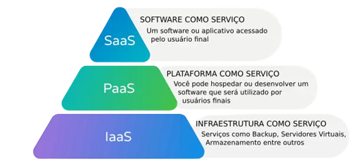

- **Infrastructure as a Service (IaaS)** - Serviços que fornecem conexão de rede, SOs, armazenamento, alta flexibilidade de utilização. Costumam ser genéricos, podem ser utilizados para vários fins. Ex: EC2.

- **Platform as a Service (PaaS)** - Você não precisa mais gerenciar a infraestrutura subjacente e pode manter o foco na implantação e no gerenciamento de aplicativos. Desta forma, o Datacenter é responsável pelos recursos físicos ou virtuais, softwares, manutenção e alguns itens de segurança. São serviços que fornecem uma plataforma para deployment, restauração, manutenção de dados, mas não te dão acesso ao SO diretamente, Ex: Elastic BeanStalk, S3.

- **Software as a Service (SaaS)** - Diferente dos outros modelos, é executado e gerenciado pelo provedor de serviços, dispensando a aquisição, instalação e manutenção de softwares e equipamentos. É muito utilizado em aplicativos de usuários finais (Spotify, Netflix e Gmail). Nesse modelo, o cliente não compra a licença de um produto, mas o direito de usufruir do serviço oferecido mediante pagamentos recorrentes.

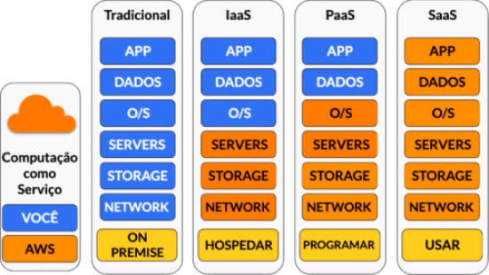

<details>
  <summary><strong><h3> Escalabilidade </h3></strong></summary>

A escalabilidade é a habilidade de expandir ou diminuir a capacidade de um sistema sem perder o desempenho, além de ser relativamente barato e rápido.

As organizações que não contam com a escalabilidade em Cloud Computing estão fortemente ligadas às restrições físicas, como servidores e storages, etc. Muitas vezes, esses pontos são grandes impeditivos na concretização de novos negócios ou no aproveitamento de oportunidades inesperadas. Por outro lado, com a Cloud a infraestrutura pode aumentar ou diminuir e adaptar-se em harmonia com as necessidades da empresa. 

A elasticidade em Cloud Computing torna mais fácil reagir rapidamente a todo tipo de evento. A grande vantagem é que você só paga pelos recursos que utilizar, quando utilizar. Simplificando, se um sistema de computação em nuvem (redes, armazenamento, servidores, aplicativos e serviços) puder responder rapidamente para atender a novas demandas – em tamanho ou volume – ele é escalável.

Existem dois tipos de escalabilidade:
- **Vertical**:

O escalonamento vertical é adicionar mais recursos ao hardware do servidor, como como CPU, memória e armazenamento, ou melhorar o desempenho do disco, alterando-o para um mais rápido. Ou seja,  é comprar um hardware mais poderoso para dar conta da necessidade.

Esse método é rápido e normalmente não requer nenhuma alteração arquitetural, especialmente na computação em nuvem, onde é possível aumentar a capacidade de uma máquina virtual com apenas alguns cliques. Porém, o hardware poderá atingir o limite de seu crescimento, e não ser o suficiente para atender a necessidade.

- **Horizontal (elasticidade)**:

Diferente do escalonamento vertical, o horizontal envolve adicionar mais instancias (máquinas) ao servidor ou banco de dados ao invés de apenas uma máquina robusta, aumentando a capacidade de processamento e memória.

Isso implica aumentar o número de nós no cluster e reduzir as responsabilidades de cada nó membro. Com o maior número de nós (máquinas), a carga diminui devido à distribuição entre os nós de servidor separados.


</details>

<details>
  <summary><strong><h3> Alta Disponibilidade </h3></strong></summary>
Implica em garantir que os recursos de TI estejam disponíveis a todo momento, mesmo que ocasionalmente ocorra algum problema de infraestrutura, como falta de energia, as cargas de trabalho devem continuar a ser executadas independentemente.

Desta forma, a alta disponibilidade significa criar/implementar processos para detectar pontos de falha, reduzindo as chances de ocorrências e criar redundância e replicação nos processos.

Para projetar uma arquitetura de alta disponibilidade, três elementos-chave devem ser considerados: redundância, monitoramento e failover:

_Redundância_ significa que vários componentes podem executar a mesma tarefa. O problema de um único ponto de falha é eliminado porque os componentes redundantes podem assumir uma tarefa executada por um componente que falhou.

_Monitoramento_ significa verificar se um componente está ou não funcionando adequadamente.

_Failover_ é o processo pelo qual um componente secundário se torna principal quando o componente principal falha.

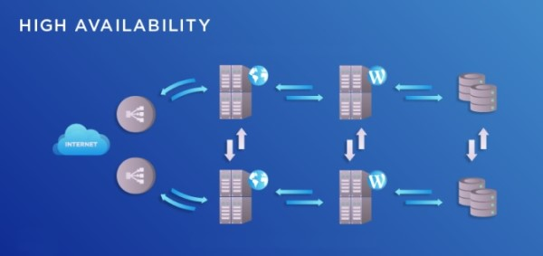
</details>

## <a id="id3"> :globe_with_meridians: Infraestrutura Global AWS
[INÍCIO](#id99)

A infraestrutura global da AWS é construída em torno de Regiões (Regions), Zonas de Disponibilidade (AZs) e Pontos de Presença (Edge Location).


- **Regiões (Regions)** - São áreas geográficas separadas que são utilizadas para provisionar a infraestrutura da AWS. Elas são distribuídas em todo o mundo para que os clientes possam escolher uma região mais próxima a eles. Quanto mais próxima a região estiver, melhor, desta forma é possível reduzir a latência de rede para os usuários finais. Em cada região existem vários locais isolados, conhecidos como _zonas de disponibilidade_. 

$\textcolor{gold}{\textsf{Memorizar:}}$ _[Região(Zonas Disponiblidade)]_

As regiões são mais tolerantes a falhas e tem maior estabilidade porque são isoladas umas das outras. Elas têm seus próprios recursos e esses recursos não replicam dados para outras regiões automaticamente, se quisermos/precisarmos transferir dados entre regiões, então temos que realizar as devidas configurações.

Região = Conjunto de data centers em uma localização geográfica.

- **Zonas de disponibilidade (AZ's)** - Em cada região são agrupados data centers, e cada grupo de data centers forma uma zona de disponibilidade. Cada AZ pertence a uma determinada região, cada região tem no mínimo 2 AZ's, se a infraestrutura de uma falhar, a outra continua atendendo e a sua aplicação continua disponível. Elas são isoladas, separadas a quilômetros de distância com energia, rede e conectadas por meio de links de alta velocidade, baixa latência e altamente redundante.

$\textcolor{gold}{\textsf{Memorizar:}}$ _[Região(Zonas Disponibilidade:data centers)]_

Zonas de Disponibilidade = Conjunto de datacenters em determinada região, mas com sua estrutura física totalmente separada.

- **Pontos de Presença (Edge Locations)** - É uma infraestrutura de servidores distribuídos em diversas partes do mundo onde são utilizados para entregar conteúdo aos usuários finais com menor latência. A Amazon utiliza o seu serviço de CDN (Content Delivery Network), o CloudFront que utiliza o armazenamento de cache para acelerar a navegação dos usuários em serviços estáticos, como por exemplo imagens, vídeos e páginas html.

$\textcolor{salmon}{\textsf{Exemplo:}}$ Supondo que você está no Brasil e quer enviar dados para Sydney. A primeira vez que for enviado, devido a distância geográfica, terá uma latência mais elevada. Mas após isso o dado é armazenado em cache em servidores proximo a localização. Desta forma, a próxima vez que o dado for solicitado, será entregue com muito menor latência.

$\textcolor{gold}{\textsf{Memorizar:}}$ _[Região(Zonas Disponibilidade:data centers)PoP]_


### Responsabilidade Compartilhada

> While the AWS manages security **OF** the cloud, you are responsible for segurity **IN** the cloud.

A responsabilidade compartilhada é um conceito da Amazon Web Services que define a divisão das responsabilidades entre a AWS como provedor da infraestrutura de nuvem e o cliente que utiliza os serviços da AWS para implantar e gerenciar suas aplicações.

A AWS é responsável pela segurança e proteção dos serviços subjacentes, como servidores físicos, data centers, rede, hipervisor e infraestrutura global. Isso inclui a proteção física dos data centers, a manutenção dos servidores e a segurança da rede em que os serviços são executados.

Já o cliente da AWS, é responsável pela segurança da sua carga de trabalho (workload) e dos dados que armazena e processa nos serviços da AWS. Isso inclui a configuração correta dos recursos, a definição adequada de permissões e políticas de acesso, o controle do acesso às instâncias EC2, o gerenciamento de chaves de criptografia, entre outros aspectos.

**Responsabilidade da AWS:**
- Proteger a infraestrutura física dos data centers, incluindo vigilância, controle de acesso, resiliência, energia e refrigeração;
- Manter e atualizar a infraestrutura, incluindo hardware, redes e software subjacente dos serviços;
- Proteger a rede global que conecta os data centers e os serviços da AWS;
- Garantir a conformidade com várias certificações de segurança e conformidade.

**Responsabilidade do Cliente:**
- Configurar e gerenciar adequadamente os recursos da AWS que utiliza, como instâncias EC2, grupos de segurança, tabelas do DynamoDB, etc;
- Controlar o acesso aos seus recursos usando políticas de controle de acesso (IAM) e grupos de segurança;
- Configurar e manter firewalls e proteções adicionais para suas aplicações, se necessário;
- Gerenciar chaves de criptografia e proteger dados sensíveis.

Em resumo, a AWS é responsável pela segurança da infraestrutura física e dos serviços que oferece, enquanto o cliente é responsável por garantir a segurança de sua própria carga de trabalho, aplicativos e dados, bem como por implementar boas práticas de segurança na configuração e no gerenciamento dos recursos da AWS que você utiliza. A compreensão dessa divisão de responsabilidades é essencial para garantir que a implantação na AWS seja segura e esteja em conformidade com os padrões de segurança e privacidade.

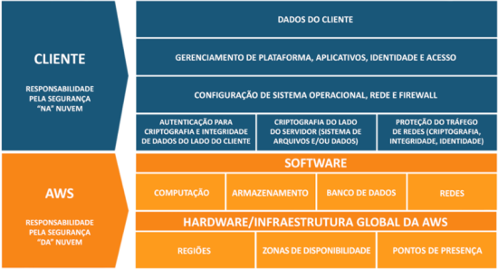

## <a id="id4"> :closed_lock_with_key: Segurança e AWS IAM
[INÍCIO](#id99)

O [IAM](https://aws.amazon.com/pt/iam/) (Identity and Access Management) é um serviço que permite controlar o acesso e a segurança dos recursos da AWS. Com o IAM, você pode criar e gerenciar identidades (como usuários, grupos e funções) e definir permissões, determinando quais ações elas podem realizar em quais recursos da AWS. O IAM permite que você conceda acesso apenas aos recursos necessários para cada usuário ou processo, melhorando a segurança e ajudando a seguir o princípio do menor privilégio.

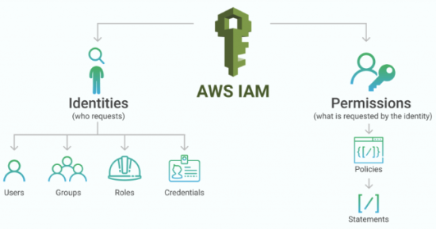

**Usuários (Users):** Representam indivíduos que podem autenticar e interagir com a AWS. Cada usuário é associado a credenciais de login (nome de usuário e senha) ou pode ser configurado para usar acesso federado (por exemplo, com um provedor de identidade corporativa). Os usuários são atribuídos a permissões por meio de políticas de controle de acesso.

**Grupos (Groups):** Os grupos são conjuntos de usuários com permissões em comum. Em vez de definir permissões individuais para cada usuário, você pode atribuir políticas ao grupo e todos os usuários pertencentes a esse grupo herdarão essas permissões.

**Funções (Roles):** As funções são comumente usadas para conceder acesso temporário a recursos específicos. Isso é especialmente útil para aplicativos que rodam em serviços como o AWS Lambda.

**Políticas (Polices):** As políticas são documentos JSON que definem as permissões para ações específicas em recursos da AWS. Elas podem ser associadas a usuários, grupos ou funções. As políticas são flexíveis e podem ser detalhadas até mesmo para recursos específicos dentro de um serviço da AWS.

**Permissões (Permissions):** As permissões são concedidas através da combinação de políticas atribuídas a usuários, grupos e funções. Cada ação na AWS é protegida por um controle de acesso que pode ser permitido ou negado com base nas permissões definidas nas políticas. Ou seja, é um conjunto de permissões.

❗ $\textcolor{salmon}{\textsf{Observação:}}$

- Um usuário pode estar contido em **vários** grupos; 
- Um grupo pode conter **vários** usuários;
- Um grupo **NÃO** pode conter outro grupo;
- Cada grupo ou usuário pode possuir de **N** policies;
- Quando um usuário é adicionado a um grupo, ele automaticamente é associado a todas as policies (e as permissões anexadas a elas).

A imagem a seguir mostra um exemplo simples de uma conta da AWS com três grupos. O grupo é um conjunto de usuários que têm responsabilidades semelhantes.

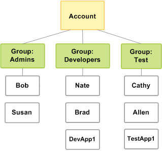

**IAM MFA Overview (Autenticação Multifator)** - É um processo de autenticação complementar do login, que utiliza várias etapas que obriga o usuário a inserir informações que vão além de uma simples senha.

$\textcolor{salmon}{\textsf{Exemplo:}}$ Juntamente com a senha, os usuários podem ser solicitados a inserir um código que foi enviado para o e-mail deles, responder a uma pergunta secreta ou verificar uma impressão digital. Em caso de comprometimento de uma senha do sistema, uma segunda forma de autenticação pode ajudar a impedir o acesso não autorizado à conta.

<details>
  <summary><strong><h4>Perguntas Frequentes</h4></strong></summary>

1. **Posso habilitar e desabilitar o acesso de um usuário?**

Sim. Você pode habilitar e desabilitar as chaves de acesso de um usuário do IAM por meio de APIs do IAM, da CLI da AWS ou do console do IAM. Se você desabilitar as chaves de acesso, o usuário não poderá acessar programaticamente os serviços da AWS.

2. **Os nomes de usuários do IAM têm de ser endereços de e-mail?**

Não, mas podem ser. Os nomes de usuário são apenas strings ASCII que são exclusivas dentro de uma determinada conta da AWS. Você pode atribuir nomes usando qualquer convenção de nomes que escolher, incluindo endereços de e-mail.

3. **Posso definir uma política para as senhas dos meus usuários?**

Sim, você pode aplicar senhas fortes, como senhas com comprimento mínimo, com pelo menos um número ou caractere especial. Você também pode aplicar expiração automática de senhas, impedir a reutilização de senhas antigas e exigir a redefinição da senha no próximo login na AWS.
</details>

$\textcolor{salmon}{\textsf{Resumo:}}$ O IAM é uma parte essencial da estratégia de segurança da AWS, permitindo que você proteja seus recursos e dados, gerencie as identidades que podem acessá-los e audite as atividades realizadas pelos usuários. Ao usar o IAM de forma adequada, você pode garantir que apenas as pessoas e processos autorizados tenham acesso aos recursos da AWS, reduzindo o risco de violações de segurança e garantindo a conformidade com os padrões regulatórios e de segurança.

## AWS WAF
[INÍCIO](#id99)

O [AWS WAF](https://aws.amazon.com/pt/waf/) é um firewall de aplicações Web que ajuda a proteger aplicações Web de ataques por meio da configuração de regras que permitem, bloqueiam ou monitoram solicitações da Web de acordo com condições que você define. Essas condições incluem endereços IP, cabeçalhos e corpo HTTP, strings de URI, injeção de SQL e cross-site scripting.

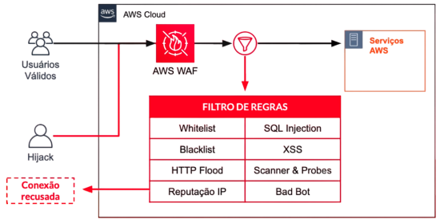

$\textcolor{salmon}{\textsf{Principais recursos e funcionalidades:}}$

**Firewall de Aplicativos Web:** O AWS WAF age como um firewall de aplicativos da web, permitindo que o cliente defina regras personalizadas para controlar o acesso a seu aplicativo web. É possivel configurar regras para permitir, bloquear ou contar solicitações com base em critérios específicos, como endereço IP, cabeçalhos HTTP, strings de consulta, entre outros.

**Proteção contra Ataques Comuns:** O WAF ajuda a proteger as aplicações web contra ataques comuns, como injeção de SQL, cross-site scripting (XSS), ataques de força bruta, bots maliciosos, entre outros. Com regras pré-configuradas e gerenciadas pela AWS ou pelo cliente, o WAF pode bloquear automaticamente solicitações maliciosas antes que elas alcancem suas aplicações.

**Regras Personalizadas:** Além das regras pré-configuradas, o cliente pode criar suas próprias regras personalizadas com expressões regulares (regex) e lógica booleana para atender aos requisitos específicos do seu aplicativo web.

**Integração com Outros Serviços da AWS:** O WAF pode ser facilmente integrado a outros serviços da AWS, como o Amazon CloudFront (Content Delivery Network) e o Application Load Balancer (ALB), permitindo que o cliente aplique a proteção do WAF em camadas de distribuição de conteúdo ou balanciamento de carga.

**Monitoramento e Logging:** O WAF oferece recursos de monitoramento e registro detalhados para que o cliente possa rastrear e analisar o tráfego web para suas aplicações. Isso ajuda a identificar padrões de ataque e permite ajustar suas regras de segurança conforme necessário.

**Suporte a Regras de Rateio:** O WAF pode limitar a taxa de solicitações de entrada para proteger sua aplicação contra ataques de força bruta ou de negação de serviço (DDoS).

**Integração com o AWS Shield:** O AWS WAF pode ser integrado ao AWS Shield, um serviço de mitigação de DDoS, para fornecer uma camada adicional de proteção contra ataques volumétricos.

$\textcolor{salmon}{\textsf{Resumo:}}$ O AWS WAF é uma parte essencial da estratégia de segurança para aplicativos web hospedados na AWS. Ele permite que você crie uma camada de segurança adicional para suas aplicações, garantindo que apenas tráfego legítimo seja permitido e protegendo contra ameaças comuns da web. Ao utilizar o WAF em conjunto com outras práticas de segurança da AWS, você pode aumentar a proteção e a confiabilidade das suas aplicações web na nuvem

## AWS Shield
[INÍCIO](#id99)

O [AWS Shield](https://aws.amazon.com/pt/shield/) é um serviço gerenciado que fornece proteção contra ataques DDoS para os aplicativos executados na AWS. 

**AWS Shield Standard:** É um serviço de proteção DDoS sem custo adicional que é automaticamente ativado para todas as contas da AWS. Ele oferece proteção contra os ataques mais comuns de camada de rede e camada de transporte, como ataques SYN/ACK, UDP reflection e DNS query floods. Essa camada básica de proteção é sempre aplicada a todos os recursos da AWS, ajudando a manter sua infraestrutura mais segura.

**AWS Shield Advanced:** É uma camada de proteção DDoS mais robusta, disponível como um serviço adicional pago. Ele oferece recursos avançados de mitigação de DDoS e suporte 24x7 com acesso a especialistas da AWS DDoS Response Team (DRT). O Shield Advanced inclui recursos como:

- Proteção avançada contra DDoS: Mitigação contra ataques mais sofisticados e de maior escala;
- Monitoramento e relatórios detalhados: Acesso a detalhes adicionais sobre os ataques, permitindo uma melhor compreensão e análise;
- Suporte prioritário: Acesso a especialistas da AWS para ajudar a mitigar ataques e fornecer orientação em tempo real;
- Proteção para aplicativos não-AWS: A possibilidade de estender a proteção do AWS Shield para aplicações e recursos fora da AWS por meio do AWS Global Accelerator.

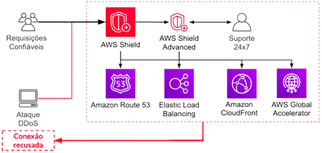

$\textcolor{salmon}{\textsf{Resumo:}}$ O AWS Shield é uma parte importante da estratégia de segurança da AWS, pois ajuda a manter a disponibilidade e a performance dos recursos, protegendo-os contra ataques DDoS que podem afetar negativamente as operações comerciais. A escolha entre o AWS Shield Standard e o AWS Shield Advanced dependerá das necessidades específicas de proteção de cada aplicação e do nível de suporte desejado durante a mitigação de possíveis ataques. Em ambos os casos, a AWS oferece uma camada extra de segurança para manter seus aplicativos e recursos protegidos contra as ameaças cada vez mais sofisticadas da internet.

## Amazon Cognito
[INÍCIO](#id99)

O [Amazon Cognito](https://aws.amazon.com/pt/cognito/) é um serviço que facilita a adição de recursos de autenticação, autorização e gerenciamento de usuários às suas aplicações web e móveis. Ele fornece uma solução completa de identidade e acesso, permitindo que o cliente se concentre no desenvolvimento do seu aplicativo, enquanto o Cognito lida com as complexidades de autenticação e gerenciamento de usuários.

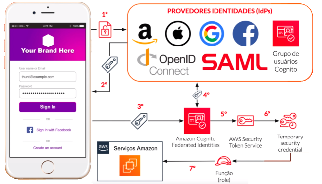

**Cognito User Pools:** É um serviço de diretório de usuários que permite que o cliente crie e gerencie facilmente uma base de usuários para a aplicação. Ele suporta o registro de novos usuários, login, recuperação de senha, verificação de e-mail e número de telefone, além de fornecer tokens de acesso e atualização para autenticação em suas APIs.

**Cognito Identity Pools:** Esse componente fornece uma solução para obter credenciais temporárias para autenticar usuários e fornecer acesso seguro a recursos da AWS. Com os pools de identidade, você pode obter identificadores únicos para usuários autenticados e não autenticados, permitindo que você controle de forma granular quais recursos eles têm acesso.

**Social Identity Providers:** O Cognito suporta a integração com provedores de identidade social, como Google, Facebook e Amazon, o que permite que os usuários usem suas contas existentes para fazer login em sua aplicação.

**Custom Authentication (Autenticação Personalizada):** Se o cliente tiver requisitos específicos de autenticação, o Cognito permite a criação fluxos de autenticação personalizados usando o AWS Lambda, permitindo uma maior flexibilidade no processo de autenticação.

**Segurança:** O Cognito protege as informações do usuário com criptografia e medidas de segurança avançadas, garantindo que as credenciais do usuário sejam armazenadas com segurança e transmitidas de forma protegida.

$\textcolor{salmon}{\textsf{Resumo:}}$ O Amazon Cognito é uma excelente escolha para adicionar funcionalidades de autenticação e gerenciamento de usuários a suas aplicações. Ele é altamente escalável, seguro e fornece uma série de recursos prontos para uso, permitindo que o cliente crie uma experiência de autenticação e autorização confiável para seus usuários sem a necessidade de desenvolver tudo do zero.

## <a id="id5"> Amazon EC2
[INÍCIO](#id99)

O [Amazon **E**lastic **C**ompute **C**loud (EC2)](https://aws.amazon.com/pt/ec2/) oferece uma capacidade de computação escalável na Nuvem da AWS. É uma solução que facilita a obtenção de servidores virtuais, também conhecidos como instâncias de computadores na nuvem. O seu uso elimina a necessidade de investir em hardware inicialmente, portanto, você pode desenvolver e implantar aplicativos com mais rapidez.

É possível usar o EC2 para executar quantos servidores virtuais forem necessários, configurar a segurança e gerenciar o armazenamento. Além disso, permite aumentar ou reduzir a escala para lidar com alterações nos requisitos ou com picos em popularidade, reduzindo sua necessidade de prever o tráfego.

### Características

- **Múltiplas instâncias** - É possível escolher o tipo de instância que melhor se adéqua às suas necessidades. Também é possível mudar o tipo de instância quando necessário, aumentando ou diminuindo sua capacidade de armazenamento em minutos. O processo é simples, é preciso apenas pausar as instâncias, selecionar um novo modelo e reiniciar o processo.

- **Arquitetura confiável** - O Elastic Load Balancing ajuda a distribuir a carga entre as zonas de disponibilidade e o escalonamento automático garante a disponibilidade das aplicações.

- **Alto nível de segurança** - A Elastic Compute Cloud (EC2) usa a Amazon Virtual Private Cloud (VPC) para manter suas aplicações seguras. Você tem completo controle sobre o armazenamento, as comunicações, os usuários, os logins e o acesso à rede. Também é livre para adicionar outras camadas de segurança, como controlar se e como suas instâncias têm acesso à internet.

### Instância

Quando se executa uma instância, o tipo de instância que é especificado determina o hardware do computador host usado para sua instância. Cada tipo de instância oferece recursos de computação, memória e armazenamento diferentes, além de ser agrupado em famílias de instâncias de acordo com esses recursos. É importante selecionar o tipo de instância com base nos requisitos da aplicação ou do software que você pretende executar.

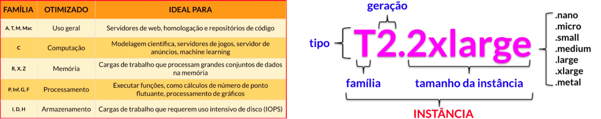

### Tipos de inicialização de instância (Launch Types)

1. **On-Demand:**
  - Alto custo se usado por longo prazo;
  - Comprado a qualquer momento, sem compromisso de permanência;
  - Paga o que usar (por hora ou segundo);
  - Sem pagamento adiantado.

É útil para cargas de trabalho de curto prazo, validar hipóteses, com pico de utilização previsível, testar e experimentar um ambiente.

2. **Reservado:**
  - Permanência mínima de 1 ano;
  - Pode ser comprado no modo 24/7, no modo 24/7 com instância flexível ou em apenas algumas horas por semana;
  - Possui pagamento adiantado;

É útil para ambiente de produção que foi testado e não será modificado, e excelente para banco de dados.

3. **Host Dedicado:**
  - Uso de datacenter dedicado para alocação de instâncias;
  - Servidor físico EC2 exclusivo;
  - Permanência de 3 anos.

É útil para vincular licenças de software.

4. **Instância Dedicada:**
  - Hardware dedicado;
  - Permanência de 3 anos;
  - Compartilha o hardware com outras istâncias na mesma conta;
  - Só pode movimentar o hardware se interromper e reiniciar.

| <div align="center">CARACTERÍSTICA</div> | <div align="center">Instâncias <br>Dedicadas</div> | <div align="center">Hosts <br>Dedicados</div> |
| --- | --- | --- |
| <div align="center">Permite o uso de servidores físicos dedicados</div> | <div align="center">X</div> | <div align="center">X</div> |
| <div align="center">Faturamento por instância</div> | <div align="center">X</div> | <div align="center">X</div> |
| <div align="center">Faturamento por host</div> | | <div align="center">X</div> |
| <div align="center">Visibilidade de soquetes, núcleos, IDs de host</div> | | <div align="center">X</div> |
| <div align="center">Afinidade entre um host e uma instância</div> | | <div align="center">X</div> |
| <div align="center">Inserção de instância específica</div> | | <div align="center">X</div> |
| <div align="center">Inserção de instância automática</div> |<div align="center">X</div> | <div align="center">X</div> |
| <div align="center">Adicione capacidade usando uma solicitação de alocação</div> | | <div align="center">X</div> |

5. **Instancias Spot:**
  - Menor valor;
  - Não recomendado para trabalhos críticos e banco de dados;
  - São finalizadas quando o preço do spot, é maior do que o preço que você estabeleceu para pagar.

É útil para uma urgência, serviços que podem ser parados e iniciados novamente, análise de dados, processamento de imagens.

## <a id="id6"> :arrow_up_down: Auto Scaling Group (ASG)</a>
[INÍCIO](#id99)

O [AWS Auto Scaling](https://aws.amazon.com/pt/autoscaling/) é um serviço da AWS para ajudar a otimizar o desempenho de aplicativos e reduzir custos de infraestrutura por meio da escalabilidade fácil e segura de vários recursos da AWS. Ele monitora os aplicativos e ajusta automaticamente a capacidade para manter um desempenho constante e previsível pelo menor custo possível.

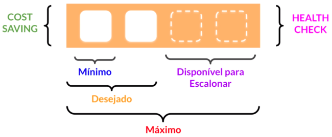

Principais características e conceitos:

- [x] Escalabilidade Automática: Serviço que responde automaticamente a mudanças. Se a demanda aumentar, o ASG adiciona novas instâncias para lidar com o aumento da carga; se a demanda diminuir, ele remove instâncias extras para economizar custos.
- [x] Realiza verificações de health check nas instâncias. Finaliza as instâncias não saudáveis (unhealthy) e inicia novas;
- [x] Scale out (aumentar com a necessidade de demanda) e Scale in (diminuir quando a demanda deixa de ocorrer);
- [x] Gratuito, paga apenas pelos recursos utilizados.

$\textcolor{salmon}{\textsf{Resumo:}}$ O Auto Scaling Group é uma ferramenta que visa garantir que sua aplicação tenha capacidade suficiente para lidar com variações na demanda sem a necessidade de intervenção manual. Ele permite que o cliente configure e gerencie facilmente o dimensionamento automático das instâncias EC2, tornando a infraestrutura mais eficiente, escalável e resiliente. Com o ASG, você pode manter a disponibilidade e o desempenho da sua aplicação, independentemente das flutuações na demanda do usuário.

## <a id="id7"> :symbols: AWS Lambda</a>
[INÍCIO](#id99)

O [AWS Lambda](https://aws.amazon.com/pt/lambda/) é um serviço de computação sem servidor que permite que você execute código de forma assíncrona, sem precisar provisionar ou gerenciar servidores. Com o Lambda, você pode executar pequenas unidades de código, conhecidas como "funções", em resposta a eventos específicos, como chamadas de API, uploads de arquivos, alterações em bancos de dados, entre outros.

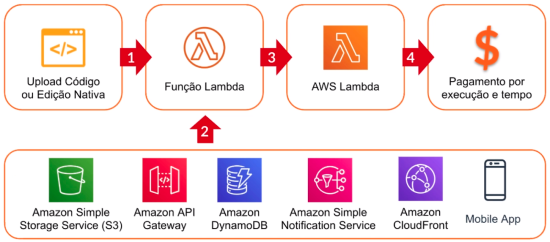

**Suporte a Linguagens de Programação:** O Lambda suporta várias linguagens de programação, incluindo Node.js, Python, Ruby, Java, Go, .NET Core e muito mais. Isso oferece flexibilidade para desenvolver suas funções em uma linguagem que você esteja familiarizado.

**Tempo de Execução e Recursos Configuráveis:** Você pode definir o tempo máximo de execução da função e configurar a quantidade de memória alocada para ela. Isso permite otimizar o desempenho da função e ajustar os recursos de acordo com as necessidades do código.

**Custo Efetivo:** O Lambda é cobrado pelo tempo de execução real das funções, com uma quantidade gratuita de execuções e recursos disponíveis para começar. Como você paga apenas pelas invocações das funções e pela quantidade de recursos consumidos durante a execução, o Lambda pode ser uma opção de custo efetivo para muitos casos de uso.

$\textcolor{salmon}{\textsf{Resumo:}}$ O AWS Lambda é uma ferramenta para a criação de aplicações escaláveis, altamente disponíveis e sem servidor. Ele permite que os desenvolvedores criem microsserviços e funções que respondam a eventos específicos, sem a necessidade de gerenciar a infraestrutura subjacente. Com o Lambda, você pode se concentrar no desenvolvimento do código e criar soluções ágeis, reativas e prontas para a nuvem.

## <a id="id8"> Elastic Beanstalk</a>
[INÍCIO](#id99)

O [AWS Elastic Beanstalk](https://aws.amazon.com/pt/elasticbeanstalk/) é um serviço que simplifica o processo de implantação, gerenciamento e escalabilidade de aplicativos e serviços na nuvem. Ele permite que desenvolvedores e equipes de operações implantem facilmente suas aplicações web e APIs em ambientes altamente disponíveis, sem se preocupar com a complexidade da infraestrutura subjacente.

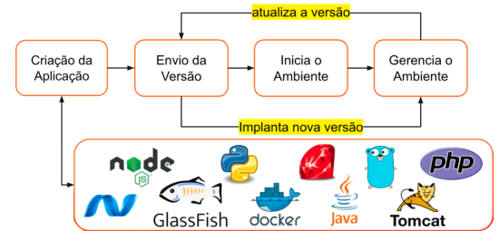

Principais características e conceitos do AWS Elastic Beanstalk:

**Ambientes:** O Elastic Beanstalk suporta diferentes ambientes, como ambientes para aplicações web e ambientes de trabalhadores para processamento de tarefas em segundo plano. Cada ambiente é uma coleção de recursos da AWS, incluindo instâncias EC2, balanceadores de carga, grupos de auto scaling, entre outros, necessários para executar e escalonar o aplicativo.

**Linguagens de Programação:** O Elastic Beanstalk suporta várias linguagens de programação populares, incluindo Node.js, Python, Java, Ruby, PHP, .NET e Go. Isso permite que você desenvolva e implante aplicações em sua linguagem preferida.

**Infraestrutura Gerenciada:** O Elastic Beanstalk gerencia automaticamente a infraestrutura subjacente, incluindo provisionamento e configuração de recursos da AWS, balanceamento de carga, dimensionamento automático, monitoramento e recuperação de falhas. Isso permite que você se concentre no desenvolvimento do aplicativo e na lógica de negócios, em vez de preocupar-se com a configuração e gerenciamento da infraestrutura.

**Versionamento e Implantação:** O Elastic Beanstalk facilita a implantação de novas versões do seu aplicativo. Você pode fazer o upload de um novo pacote de aplicativo ou integra-lo a serviços de controle de versão, como o Git, e o Elastic Beanstalk cuidará da implantação e do balanceamento de carga entre as diferentes versões.

**Personalização e Controle:** Apesar de gerenciar a infraestrutura automaticamente, o Elastic Beanstalk oferece a flexibilidade de personalizar configurações e recursos da AWS, permitindo que você defina políticas de auto scaling, configure variáveis de ambiente, faça ajustes de performance e muito mais.

**Integração com Outros Serviços AWS:** O Elastic Beanstalk é compatível com uma ampla gama de serviços AWS, como o Amazon RDS (Relational Database Service), Amazon S3 (Simple Storage Service), Amazon CloudWatch para monitoramento e muitos outros, permitindo que você crie aplicativos altamente integrados e resilientes.

$\textcolor{salmon}{\textsf{Resumo:}}$ O AWS Elastic Beanstalk é uma excelente opção para desenvolvedores que desejam implantar aplicativos web e APIs rapidamente, sem lidar diretamente com as complexidades da infraestrutura em nuvem. Ele combina facilidade de uso com flexibilidade e escalabilidade, permitindo que você aumente ou diminua a escala do seu aplicativo conforme a demanda do usuário. Ao automatizar muitos aspectos do gerenciamento da infraestrutura, o Elastic Beanstalk permite que as equipes se concentrem na criação de código e na entrega de valor aos usuários finais.

## <a id="id9"> Amazon Lightsail</a>
[INÍCIO](#id99)

O [Amazon Lightsail](https://aws.amazon.com/pt/lightsail/) é um serviço de hospedagem e computação simplificado que fornece uma maneira fácil e rápida para iniciar, gerenciar e dimensionar aplicações e sites na nuvem. É uma opção ideal para desenvolvedores, equipes de pequeno porte e iniciantes que buscam uma solução de hospedagem com recursos previsíveis e sem a complexidade de outros serviços da AWS.

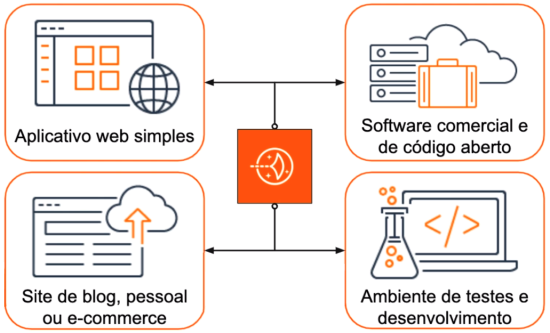

Principais características e conceitos do AWS Lightsail:

**Instâncias Pré-configuradas:** O Lightsail oferece instâncias pré-configuradas, que são pacotes de recursos de computação, memória, armazenamento e largura de banda projetados para diferentes cargas de trabalho, como sites, blogs, aplicativos web e bancos de dados.

**Fácil Implantação:** Com o Lightsail, você pode lançar rapidamente uma instância pré-configurada com apenas alguns cliques no console da AWS ou usando a interface da linha de comando. Isso torna a implantação de aplicações web e sites uma tarefa simples, mesmo para usuários sem muita experiência em nuvem.

**Opções de Sistema Operacional:** O Lightsail oferece uma variedade de sistemas operacionais, como Amazon Linux, Ubuntu, Windows e outros, permitindo que você escolha a plataforma mais adequada para suas necessidades.

**Backup Automático:** O Lightsail oferece opções de backup automáticos, permitindo que você programe backups diários, semanais ou mensais para proteger seus dados e facilitar a recuperação em caso de perda de informações.

**Integração com Outros Serviços AWS:** Embora o Lightsail seja uma solução simplificada, ele ainda pode ser integrado com outros serviços da AWS, como o Amazon RDS (Relational Database Service), o Amazon S3 (Simple Storage Service) e o Amazon CloudFront, para aumentar a funcionalidade e o desempenho de suas aplicações.

**Dimensionamento Fácil:** O Lightsail permite que você dimensione verticalmente suas instâncias (aumentando recursos) ou adicione mais instâncias, tornando o dimensionamento de sua aplicação uma tarefa simples e rápida.

**Preços Previsíveis:** O modelo de preços do Lightsail é transparente e previsível, com planos fixos que incluem recursos específicos, permitindo que você saiba exatamente o que será cobrado e evitando surpresas na fatura.

$\textcolor{salmon}{\textsf{Resumo:}}$ O AWS Lightsail é uma excelente escolha para desenvolvedores e pequenas empresas que desejam uma solução de hospedagem simples, acessível e fácil de usar na nuvem da AWS. Com recursos pré-configurados e preço transparente, o Lightsail simplifica o processo de hospedar aplicações e sites, permitindo que você se concentre no desenvolvimento e no crescimento do seu negócio, sem se preocupar com a complexidade da infraestrutura em nuvem.

## <a id="id10"> Amazon S3</a>
[INÍCIO](#id99)

O [Amazon S3](https://aws.amazon.com/pt/s3/) (Simple Storage Service) é um serviço de armazenamento e recuperação de objetos altamente escalável e durável. Ele é projetado para armazenar e recuperar grandes quantidades de dados de forma segura, escalável e altamente disponível, além de fornecer durabilidade de 99,999999999% (onze noves) o que significa que seus dados são extremamente resilientes contra falhas. O S3 é amplamente utilizado por empresas em todo o mundo para armazenar e distribuir diversos tipos de dados, como arquivos de mídia, backups, documentos, logs, bancos de dados e muito mais.

Principais características e conceitos do Amazon S3:

**Buckets:** O Amazon S3 organiza os dados em "buckets" (ou "baldes"), que são contêineres de alto nível que pode conter um número ilimitado de objetos e é usado para definir a propriedade e as configurações de acesso aos objetos armazenados. Os buckets são criados em regiões específicas da AWS e têm um nome exclusivo globalmente.

**Objetos:** Um objeto é a unidade fundamental de armazenamento no S3. Pode ser qualquer tipo de arquivo, como uma imagem, vídeo, arquivo de texto, código executável etc. Cada objeto é associado a uma chave única dentro de um bucket, que é usada para acessá-lo.


**URLs e Acesso:** Cada objeto no S3 é acessível por meio de uma URL exclusiva, que geralmente segue o padrão https://s3.amazonaws.com/nome-do-bucket/caminho-para-o-objeto. Você pode configurar as permissões de acesso para os objetos e os buckets usando as políticas de controle de acesso do S3 (IAM) para garantir que apenas usuários autorizados tenham acesso aos dados.

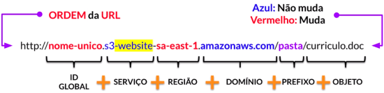

**Armazenamento Classes:** O S3 oferece diferentes classes de armazenamento para atender a requisitos de desempenho e custo. As classes mais comuns são:

- Standard: Para acesso frequente a dados.
- Intelligent-Tiering: Para dados com padrões de acesso variados.
- Glacier: Para armazenamento de backup e arquivamento de longo prazo.

**Controle de Acesso:** O S3 permite que você defina políticas de controle de acesso granular usando o AWS Identity and Access Management (IAM) para conceder permissões específicas a usuários, grupos ou funções.

**Integração com outros serviços:** O S3 pode ser facilmente integrado a outros serviços da AWS, como o Amazon CloudFront para entrega de conteúdo (CDN), o Amazon Athena para análise de dados, entre outros.

### Categorias de Armazenamento

O Amazon S3 oferece diferentes categorias de armazenamento para atender a diferentes requisitos de desempenho, disponibilidade e custo. Cada categoria de armazenamento é otimizada para cenários específicos e oferece uma combinação diferente de durabilidade, disponibilidade e custo.

Abaixo estão as principais categorias de armazenamento do Amazon S3:


- **S3 Standard:**
  - O Standard é a classe de armazenamento padrão do Amazon S3 e é projetado para alto desempenho, durabilidade e disponibilidade;
  - Os dados armazenados nessa classe são replicados automaticamente em várias Zonas de Disponibilidade (AZs), tornando-o altamente resiliente a falhas;
  - É adequado para uma ampla gama de casos de uso, como armazenamento de dados ativos, backup, compartilhamento de conteúdo e hospedagem de sites.

- **S3 Intelligent-Tiering:**
  - Oferece uma maneira automatizada de otimizar custos, movendo automaticamente os objetos entre as classes Standard e Infrequent Access (IA) com base nos padrões de acesso;
  - Objetos que são frequentemente acessados permanecem na classe Standard, enquanto objetos menos acessados são movidos para a classe IA, economizando custos.

- **S3 Standard-Infrequent Access (S3 Standard-IA):**
  - É adequada para objetos que são acessados com menos frequência, mas ainda requerem alta durabilidade e disponibilidade;
  - Os objetos armazenados nessa classe têm um custo mais baixo em comparação com o S3 Standard, mas há uma taxa de recuperação associada ao acesso a esses objetos.

- **S3 One Zone-IA:**
  - É semelhante à classe IA, mas armazena os dados em uma única Zona de Disponibilidade, em vez de múltiplas;
  - É uma opção mais econômica, mas menos resiliente em comparação com outras classes, adequada para dados que podem ser recriados facilmente ou não são críticos.

- **S3 Glacier:**
  - É projetada para arquivamento de dados de longo prazo, com recuperação eventual;
  - Os dados são armazenados em instâncias Glacier, que oferecem uma durabilidade excepcional, mas têm um tempo de recuperação maior.

- **S3 Glacier Deep Archive:**
  - É a opção mais econômica do S3 e é projetada para arquivamento de dados que raramente precisam ser acessados;
  - Os dados armazenados aqui têm tempos de recuperação mais longos e são adequados para cenários em que a recuperação imediata não é uma prioridade.

Ao escolher uma categoria de armazenamento do Amazon S3, é importante considerar os requisitos de desempenho, disponibilidade, durabilidade e custo dos seus dados. As diferentes classes de armazenamento permitem que você otimize os custos, selecionando a categoria que melhor se adapta ao comportamento de acesso dos seus objetos.
<details>
  <summary><strong><h4>Perguntas Frequentes</h4></strong></summary>

1. **O que é o Amazon S3?**

O Amazon S3 é um armazenamento de objetos criado para armazenar e recuperar qualquer quantidade de dados de qualquer local na Internet. Ele é um serviço de armazenamento simples que oferece uma infraestrutura de armazenamento de dados com escalabilidade infinita a um custo bastante reduzido.

2. **O que posso fazer com o Amazon S3?**

O Amazon S3 disponibiliza uma interface de serviço da Web simples que pode ser usada para armazenar e recuperar qualquer quantidade de dados, a qualquer momento, de qualquer lugar na Web. Como o Amazon S3 é altamente escalável e você só paga pelo que usa, é possível começar com um porte reduzido e expandir o aplicativo da forma desejada, sem comprometer o desempenho ou a confiabilidade.

3. **Quais tipos de dados eu posso armazenar no Amazon S3?**

Você pode armazenar praticamente qualquer tipo de dados em qualquer formato.

4. **Qual quantidade de dados é possível armazenar no Amazon S3?**

O volume total de dados e o número de objetos que você pode armazenar são ilimitados. Objetos individuais do Amazon S3 podem variar em tamanho, desde um mínimo de 0 byte até um máximo de 5 terabytes.
</details>

$\textcolor{salmon}{\textsf{Resumo:}}$ O Amazon S3 é amplamente utilizado por empresas e desenvolvedores de todos os tamanhos para armazenar, proteger e compartilhar dados na nuvem. Com sua alta durabilidade, escalabilidade e recursos avançados de controle de acesso, o S3 é uma solução robusta e confiável para armazenamento de objetos, fornecendo a base para muitos aplicativos, sites e serviços na nuvem da AWS.

## <a id="id11"> Amazon EBS</a>
[INÍCIO](#id99)

O [Amazon Elastic Block Store (EBS)](https://aws.amazon.com/pt/ebs/) permite que você crie volumes de armazenamento persistentes e anexáveis a instâncias do Amazon EC2, fornecendo armazenamento de alto desempenho para suas aplicações.

Principais características e conceitos do Amazon EBS:

**Volumes de EBS:** Os volumes de EBS são unidades de armazenamento que podem ser anexadas às instâncias EC2. Eles são usados para armazenar dados, sistemas de arquivos, bancos de dados e qualquer outro tipo de conteúdo que exija armazenamento persistente.

**Tipos de Volumes:** O EBS oferece diferentes tipos de volumes, cada um otimizado para diferentes casos de uso:

  - SSD (Solid State Drive): Volumes de estado sólido que oferecem alto desempenho, como o tipo gp2 (General Purpose SSD) e io2 (Provisioned IOPS SSD).
  - HDD (Hard Disk Drive): Volumes magnéticos que oferecem capacidade econômica, como o tipo st1 (Throughput Optimized HDD) e sc1 (Cold HDD).

**Persistência:** Os volumes de EBS são persistentes, o que significa que os dados persistem mesmo depois de a instância EC2 ser desligada ou encerrada. Isso é crucial para armazenar dados de aplicativos que precisam ser mantidos entre as reinicializações.

**Snapshots:** Os snapshots são cópias incrementais dos volumes de EBS, permitindo criar backups dos dados. Eles são armazenados no Amazon S3 e podem ser usados para restaurar ou criar novos volumes a partir dos dados do snapshot.

**Alta Disponibilidade:** O EBS oferece replicação automatizada de volumes dentro de uma Zona de Disponibilidade (AZ), garantindo alta disponibilidade e tolerância a falhas. Você também pode criar réplicas entre várias AZs.

**Desempenho Dimensionável:** Muitos tipos de volumes de EBS oferecem desempenho escalável. Você pode provisionar IOPS (operações de entrada/saída por segundo) para volumes io2, por exemplo, para atender a cargas de trabalho intensivas em I/O.

**Dimensionamento:** Você pode redimensionar (aumentar ou diminuir) o tamanho de um volume de EBS enquanto ele está em uso, permitindo ajustar a capacidade de armazenamento sem interromper as operações.

**Uso com Instâncias EC2:** Os volumes de EBS são projetados para serem usados com instâncias EC2. Você pode anexar e desanexar volumes conforme necessário e transferi-los entre instâncias.

## <a id="id12"> Amazon EFS</a>
[INÍCIO](#id99)

O [Amazon Elastic File System (Amazon EFS)](https://aws.amazon.com/pt/efs/) é um serviço de armazenamento de arquivos altamente escalável e gerenciado oferecido pela Amazon Web Services (AWS). Ele fornece um sistema de arquivos compartilhado que pode ser acessado por várias instâncias EC2 simultaneamente, permitindo que você compartilhe e acesse dados entre instâncias de maneira eficiente.

Principais características e conceitos do Amazon EFS:

**Sistema de Arquivos Compartilhado:** O EFS oferece um sistema de arquivos que pode ser montado e compartilhado entre várias instâncias EC2 em uma mesma VPC (Virtual Private Cloud) ou mesmo entre diferentes VPCs usando o VPC Peering.

**Escalabilidade Automática:** O EFS é altamente escalável e ajusta automaticamente a capacidade de armazenamento e o throughput à medida que você adiciona ou remove arquivos. Isso elimina a necessidade de provisionamento manual.

**Disponibilidade e Durabilidade:** Os dados armazenados no Amazon EFS são automaticamente replicados em várias Zonas de Disponibilidade (AZs) dentro de uma região, garantindo alta disponibilidade e durabilidade.

**Acesso Simultâneo:** O EFS permite que várias instâncias EC2 acessem o mesmo sistema de arquivos ao mesmo tempo, facilitando o compartilhamento de dados entre instâncias em um ambiente de cluster ou aplicativo distribuído.

**Desempenho Dimensionável:** O EFS oferece opções de desempenho configuráveis para se adequar às necessidades da sua aplicação. Você pode escolher entre diferentes modos de desempenho, como o modo Padrão ou o modo Max I/O, dependendo das cargas de trabalho.

**Acessos de Leitura e Escrita:** O EFS suporta acesso de leitura e escrita simultâneo, permitindo que várias instâncias acessem e modifiquem os mesmos arquivos ao mesmo tempo.

**Custo Efetivo:** O modelo de preços do Amazon EFS é baseado no armazenamento utilizado, sem taxas adicionais por acesso ou transferência de dados. Isso torna o EFS uma opção econômica para compartilhar dados entre instâncias EC2.

**Suporte a Soft Links e Permissões:** O EFS suporta recursos como soft links, permissões de acesso POSIX e outras funcionalidades de sistemas de arquivos padrão.

$\textcolor{salmon}{\textsf{Resumo:}}$ O Amazon EFS é particularmente útil em cenários onde várias instâncias EC2 precisam compartilhar dados, como aplicativos de conteúdo, análise de dados distribuída, processamento de lotes e muito mais. Ele simplifica o gerenciamento de armazenamento compartilhado, eliminando a necessidade de configurar servidores de arquivos dedicados e permitindo que as instâncias acessem dados de maneira eficiente e escalável.

## <a id="id13"> Amazon S3 Glacier</a>
[INÍCIO](#id99)

O [Amazon S3 Glacier](https://aws.amazon.com/pt/s3/storage-classes/glacier/) é um serviço projetado para armazenar dados que são raramente acessados e podem ser arquivados por um longo período, oferecendo uma solução econômica para retenção de dados a longo prazo e conformidade regulatória.

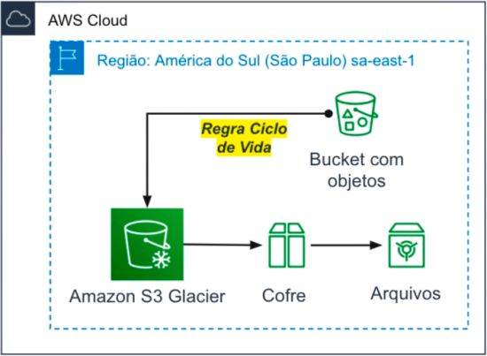

Principais características e conceitos do Amazon S3 Glacier:

**Arquivamento de Longo Prazo:** O S3 Glacier é ideal para armazenar dados que precisam ser retidos por um longo período, como registros históricos, backups, arquivos de auditoria, dados regulatórios e similares.

**Acesso Ocasional:** O acesso a dados armazenados no S3 Glacier é projetado para ser ocasional e não imediato. Isso significa que a recuperação de dados pode levar algumas horas, o que o torna adequado para cenários onde o acesso imediato não é uma prioridade.

**Políticas de Retenção:** Você pode criar políticas de retenção que definem quanto tempo os dados devem ser mantidos no S3 Glacier. Isso ajuda a cumprir requisitos regulatórios e a garantir que os dados sejam mantidos pelo tempo necessário

**Preços Econômicos:** O S3 Glacier é uma opção econômica para armazenar grandes volumes de dados que raramente são acessados. No entanto, lembre-se de que as taxas de recuperação de dados podem variar com base na opção de recuperação selecionada.
<details>
  <summary><strong><h4>Perguntas Frequentes</h4></strong></summary>
  
1. **Como escolher entre o Amazon S3 Glacier e o Amazon Simple Storage Service (Amazon S3)?**

O Amazon S3 é um serviço de armazenamento durável, seguro, simples e rápido, projetado para facilitar a computação de escala da Web para desenvolvedores. Use o Amazon S3 se precisar de baixa latência ou acesso frequente aos dados. Use o Amazon S3 Glacier caso o armazenamento de baixo custo seja primordial e não seja necessário acessar os dados em milissegundos.

2. **O que a Amazon faz com meus dados no Amazon S3 Glacier?**

A Amazon armazenará os dados e controlará o uso associado para efeitos de cobrança. A Amazon não acessará seus dados para nenhuma outra finalidade, fora da oferta do Amazon S3 Glacier, exceto quando exigido por lei.

3. **Qual a resiliência do Amazon S3 Glacier?**

O Amazon S3 Glacier foi projetado para fornecer durabilidade anual média de 99,999999999% para um arquivo.

4. **Qual a confiabilidade do Amazon S3 Glacier?**

O Amazon S3 Glacier foi projetado para proporcionar disponibilidade de 99,99%.

5. **O que é o S3 Glacier Deep Archive?**

O S3 Glacier Deep Archive é uma nova classe de armazenamento do Amazon S3 que oferece armazenamento de objetos seguro e resiliente para retenção de dados de longo prazo, acessados uma ou duas vezes por ano.

6. **Como será cobrada a exclusão de dados com menos de 3 meses?**

O Amazon S3 Glacier foi projetado para casos de uso em que os dados são retidos por meses, anos ou décadas. A exclusão de dados do Amazon S3 Glacier é gratuita se o arquivo excluído estiver armazenado a pelo menos três meses. Se o arquivo for excluído antes dos três meses após o upload, será cobrada uma tarifa de exclusão antecipada.

7. **Como posso recuperar os dados do serviço?**

Quando você faz uma solicitação para recuperar dados do S3 Glacier, inicia um trabalho de recuperação para um arquivo. Depois que o trabalho de recuperação for concluído, seus dados estarão disponíveis para download ou acesso por 24 horas.
</details>

$\textcolor{salmon}{\textsf{Resumo:}}$ O Amazon S3 Glacier é útil para organizações que precisam arquivar e reter dados a longo prazo por razões de conformidade, regulamentação ou histórico. Embora a recuperação de dados possa levar algum tempo, o serviço oferece uma maneira eficiente e econômica de manter dados valiosos ao longo do tempo sem ocupar espaço em armazenamento ativo mais caro.

## <a id="id14"> AWS Snow Family</a>
[INÍCIO](#id99)

A [família AWS Snow](https://aws.amazon.com/pt/snow/) é uma série de dispositivos físicos oferecidos pela AWS que permitem transferir grandes volumes de dados para e da nuvem de maneira eficiente, especialmente em situações em que a transferência pela internet não é prática devido a limitações de largura de banda, segurança ou outras considerações.

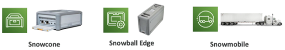


Existem vários dispositivos na família AWS Snow:

**AWS Snowcone:** É o menor dispositivo da família Snow e foi projetado para casos em que há espaço limitado para instalação ou para coletar dados em locais remotos. O Snowcone é resistente, seguro e pode ser usado em ambientes externos. Ele é conectado à rede local para copiar e transferir dados.

**AWS Snowball:** O Snowball é um dispositivo maior e mais poderoso, projetado para transferir grandes volumes de dados para a nuvem. Ele está disponível em versões com capacidades de armazenamento variando de 50 terabytes a 80 terabytes (ou até 42 petabytes com a Snowball Edge). O Snowball pode ser solicitado e enviado para o local onde os dados estão armazenados para realizar transferências rápidas e seguras.

**AWS Snowball Edge:** O Snowball Edge é uma evolução do Snowball, projetada não apenas para transferir dados, mas também para realizar processamento de dados no local. Ele pode ser usado para executar instâncias do Amazon EC2, executar funções do AWS Lambda, executar análises de dados e muito mais. O Snowball Edge oferece capacidades de armazenamento ainda maiores, juntamente com recursos de processamento e armazenamento de blocos.

**AWS Snowmobile:** O Snowmobile é uma opção para transferências de dados em larga escala que envolve literalmente um caminhão. É um contêiner móvel que pode transportar até 100 petabytes de dados. Ele é entregue no local, os dados são transferidos diretamente para o Snowmobile e depois transportados de volta para um data center da AWS.

$\textcolor{salmon}{\textsf{Resumo:}}$ Esses dispositivos são projetados para permitir que as organizações superem desafios relacionados à transferência de grandes volumes de dados para a nuvem, especialmente quando a largura de banda da internet não é suficiente ou quando a segurança é uma preocupação. Eles oferecem uma maneira eficiente e segura de mover dados para a nuvem AWS, permitindo que as empresas aproveitem os benefícios da computação em nuvem sem as limitações da transferência convencional de dados pela internet.

## <a id="id15"> AWS VPC</a>
[INÍCIO](#id99)

O [Amazon Virtual Private Cloud (VPC)](https://aws.amazon.com/pt/vpc/) é um serviço que permite criar redes isoladas logicamente na nuvem. Com o VPC, você pode criar uam rede virtual personalizada que permite customização e execução recusos, em um ambiente com controle total.

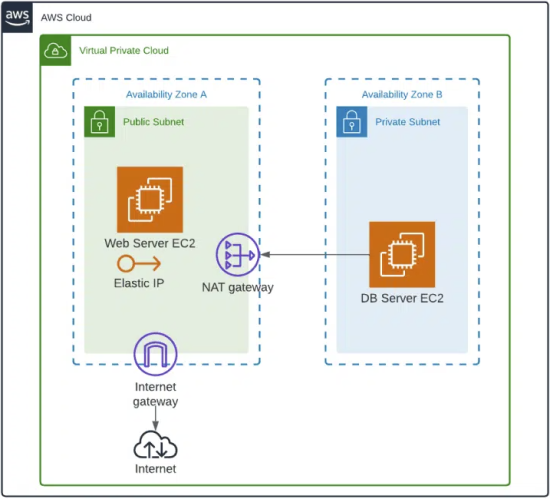

Principais conceitos e recursos do Amazon VPC:

**Rede Isolada:** O Amazon VPC permite criar uma rede isolada na nuvem, onde você tem controle total sobre a topologia de rede, endereços IP, tabelas de roteamento e configurações de segurança.

**Subnets:** Dentro de um VPC, você pode criar subnets, que são segmentos de endereços IP que podem ser usados para isolar recursos. As subnets podem ser públicas ou privadas.

**Endereços IP:** Você pode escolher os intervalos de endereços IP para suas subnets dentro do VPC. Isso permite que você projete a topologia da rede de acordo com suas necessidades.

**Internet Gateway:** Para permitir que instâncias em subnets públicas acessem a internet, você pode associar um Internet Gateway ao seu VPC.

**Elastic IP:** Os endereços IP elásticos podem ser usados para fornecer um IP estático para instâncias EC2, permitindo que elas mantenham o mesmo endereço IP mesmo após paradas e reinicializações.

**NAT Gateway/NAT Instance:** Para permitir que instâncias em subnets privadas acessem a internet para atualizações ou downloads, você pode usar um NAT Gateway ou uma instância NAT.

**Peering de VPC:** O VPC Peering permite conectar dois VPCs, permitindo que as instâncias nos VPCs se comuniquem diretamente entre si usando endereços IP internos.

$\textcolor{salmon}{\textsf{Resumo:}}$ O Amazon VPC é um serviço que permite criar redes privadas virtuais isoladas na nuvem. Com o VPC, você pode definir sua própria topologia de rede, segmentar recursos em sub-redes públicas e privadas, e controlar a conectividade e a segurança. Isso proporciona uma infraestrutura altamente flexível, semelhante a redes tradicionais de data centers, enquanto aproveita os benefícios da escalabilidade e dos serviços da AWS. Em resumo, o AWS VPC é a base para construir ambientes de nuvem personalizados e seguros, adaptados às necessidades específicas de cada aplicativo ou serviço.

## <a id="id16"> AWS Route 53</a>
[INÍCIO](#id99)

O [Amazon Route 53](https://aws.amazon.com/pt/route53/) é um serviço para gerenciar os Nomes de Domínio (DNS) altamente escalável e altamente disponível. Ele é projetado para gerenciar registros DNS e direcionar o tráfego de internet para recursos, como aplicativos web, serviços de balanceamento de carga, buckets do Amazon S3 e outros recursos da AWS.


Principais características e conceitos do Amazon Route 53:

**Gerenciamento de DNS:** O Route 53 permite que você gerencie os registros DNS associados a esses domínios. Além disso, permite converter, por exemplo, nome de "google.com.br" para seu endereço IP "216.239.38.120"

**Resolução DNS:** O Route 53 fornece resolução DNS global, o que significa que ele traduz nomes de domínio em endereços IP para permitir que os usuários acessem recursos na Internet.

| <div align="center">URL</div> | <div align="center">IP | <div align="center">REGISTRO</div> | <div align="center">TIPO</div>|
| --- | --- | --- | --- |
| <div align="center">www.google.com</div> | <div align="center">216.239.38.120</div> | <div align="center">A</div> | <div align="center">IPv4</div> |
| <div align="center">www.google.com</div> | <div align="center">0:0:0:0:0:ffff:d8ef:2678</div> | <div align="center">AAAA</div> | <div align="center">IPv6</div> |
| <div align="center">search.google.com</div> | <div align="center">www.google.com</div> | <div align="center">CNAME</div> | <div align="center">Hostname para Hostname</div> |
| <div align="center">exemple.com</div> | <div align="center">Recurso AWS</div> | <div align="center">ALIAS</div> | <div align="center">ELB, CloudFront, S3, RDS ...</div> |

**Redirecionamento de Tráfego:** O Route 53 permite criar registros DNS de forma que você possa direcionar o tráfego de entrada para diferentes destinos com base em regras, como rotas geográficas, balanceamento de carga, disponibilidade e latência.

**Registros de Saúde e Disponibilidade:** O Route 53 oferece verificações de saúde para monitorar a disponibilidade de seus recursos, como servidores web, e redireciona o tráfego para locais alternativos caso um recurso falhe.

**Balanceamento de Carga:** O Route 53 suporta balanceamento de carga para distribuir automaticamente o tráfego entre várias instâncias ou pontos de extremidade, melhorando a disponibilidade e o desempenho de suas aplicações.

**Registro de Domínio:** O Route 53 também oferece um serviço de registro de domínio, permitindo que você registre e gerencie domínios diretamente por meio do console da AWS.

$\textcolor{salmon}{\textsf{Resumo:}}$ O Amazon Route 53 é um serviço de Sistema de Nomes de Domínio (DNS) que permite registrar nomes de domínio, gerenciar registros DNS e direcionar o tráfego de internet para recursos online, como sites, aplicativos e servidores. Ele oferece resolução DNS global, redirecionamento de tráfego baseado em regras, monitoramento de disponibilidade, balanceamento de carga e suporte para registros DNS privados. O Route 53 é uma ferramenta essencial para garantir que os usuários possam acessar seus recursos online de forma confiável e eficiente, além de melhorar a disponibilidade e o desempenho de suas aplicações na nuvem da AWS.

## <a id="id17"> Amazon CloudFront</a>
[INÍCIO](#id99)

O [Amazon CloudFront](https://aws.amazon.com/pt/cloudfront/) é um serviço de Content Delivery Network (CDN) projetado para melhorar a entrega de conteúdo online, como imagens, vídeos, páginas da web e outros ativos, aos usuários finais com baixa latência e alta velocidade. O CloudFront distribui o conteúdo por uma rede global de servidores distribuídos estrategicamente, chamados de "edge locations". (Ver tópico Infraestrutura Global AWS).

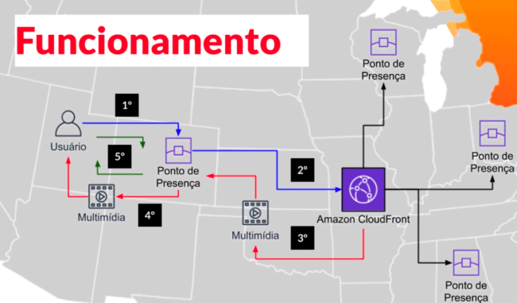

Principais características e conceitos do Amazon CloudFront:

**Distribuição Global de Conteúdo:** O CloudFront possui dezenas de edge locations em todo o mundo, permitindo que o conteúdo seja armazenado fisicamente mais próximo dos usuários finais, reduzindo a latência e melhorando o tempo de resposta.

**Cache de Conteúdo:** O CloudFront armazena em cache o conteúdo em suas edge locations, o que permite que o mesmo seja entregue mais rapidamente a usuários subsequentes que solicitem o mesmo conteúdo.

**Distribuição de Conteúdo Segura:** O CloudFront oferece recursos de segurança, como a possibilidade de usar certificados SSL/TLS para criptografar a comunicação entre os usuários e o serviço, garantindo que o conteúdo seja entregue de forma segura.

**Streaming de Mídia:** O CloudFront suporta a distribuição de streaming de áudio e vídeo, permitindo que você entregue conteúdo de mídia de alta qualidade em tempo real.

**Personalização e Compressão de Conteúdo:** O CloudFront permite personalizar como o conteúdo é entregue, incluindo a capacidade de comprimir automaticamente arquivos para reduzir o tamanho e melhorar o desempenho.

O Amazon CloudFront é usado para acelerar a entrega de conteúdo da web a nível global, melhorar a experiência do usuário final, reduzir a carga em servidores de origem e garantir a segurança da entrega de conteúdo. Ele é especialmente útil para sites e aplicativos que desejam oferecer um desempenho rápido e confiável para usuários em todo o mundo.

$\textcolor{salmon}{\textsf{Resumo:}}$ O Amazon CloudFront é um serviço de Content Delivery Network (CDN) da Amazon Web Services (AWS) que melhora a entrega de conteúdo online aos usuários finais, garantindo baixa latência e alta velocidade. Ele utiliza uma rede global de servidores distribuídos (edge locations) para armazenar e entregar conteúdo, como imagens, vídeos e páginas da web, de forma eficiente. O CloudFront oferece cache de conteúdo, distribuição segura, personalização, compressão e integração com outros serviços AWS para acelerar a entrega de conteúdo de maneira confiável e segura. É uma ferramenta essencial para otimizar o desempenho de sites e aplicativos, garantindo uma experiência de usuário rápida e consistente em todo o mundo.

## <a id="id18"> Elastic Load Balancing</a>
[INÍCIO](#id99)

O [Elastic Load Balancing (ELB)](https://aws.amazon.com/pt/elasticloadbalancing/) é um serviço que distribui automaticamente o tráfego de entrada para instâncias de Amazon EC2, contêineres, endereços IP ou zonas de disponibilidade para otimizar a disponibilidade e a escalabilidade de aplicações e serviços. O ELB ajuda a garantir que o tráfego seja distribuído de forma equilibrada entre os recursos subjacentes, melhorando a disponibilidade, a tolerância a falhas e o desempenho.

Existem três tipos principais de Elastic Load Balancers na AWS:

1. **Application Load Balancer (ALB):**

- Projetado para distribuir o tráfego de aplicativos baseados na web para várias instâncias EC2 ou contêineres.
- Oferece suporte a regras de roteamento baseadas em URL, roteamento por hostname e redirecionamentos.
- Permite usar o roteamento baseado em conteúdo, como o encaminhamento de tráfego para diferentes grupos de destino com base no conteúdo da solicitação.

2. **Network Load Balancer (NLB):**

- Projetado para tráfego TCP, UDP e TLS de alto desempenho.
- Distribui o tráfego de entrada para instâncias EC2 ou endereços IP internos em nível de porta, mantendo alta capacidade e baixa latência.
- Ideal para aplicativos que exigem alta performance e escalabilidade.

3. **Classic Load Balancer:**

- A versão anterior do ELB que oferece distribuição de tráfego para instâncias EC2 usando os protocolos HTTP, HTTPS, TCP e SSL.
- Oferece recursos de balanceamento de carga básicos, mas está sendo gradualmente substituída pelo ALB e NLB.

Principais recursos do Elastic Load Balancer:

**Balanceamento de Carga:** O ELB distribui automaticamente o tráfego de entrada entre várias instâncias EC2, contêineres ou outros recursos, melhorando o desempenho e a disponibilidade.

**Escalabilidade:** O ELB ajuda a escalar sua aplicação de maneira eficaz, adicionando ou removendo instâncias conforme necessário.

**Detecção de Saúde:** O ELB monitora a saúde das instâncias de destino, direcionando o tráfego somente para instâncias saudáveis.

**Zonas de Disponibilidade:** O ELB pode distribuir o tráfego por várias zonas de disponibilidade para garantir alta disponibilidade e redundância.

**SSL/TLS:** O ELB suporta terminação de SSL/TLS, permitindo que o tráfego criptografado seja descriptografado no load balancer e recriptografado antes de ser encaminhado para as instâncias de destino.

$\textcolor{salmon}{\textsf{Resumo:}}$ O Elastic Load Balancer (ELB) é um serviço que fornece balanceamento de carga automatizado e distribuição de tráfego para recursos como instâncias EC2, contêineres e endereços IP. O ELB ajuda a otimizar a disponibilidade e a escalabilidade de aplicações ao distribuir o tráfego de entrada de maneira uniforme entre diferentes recursos, garantindo melhor desempenho e confiabilidade. Existem três tipos de ELBs: Application Load Balancer (ALB) para aplicativos web, Network Load Balancer (NLB) para tráfego de rede de alto desempenho e Classic Load Balancer. O ELB monitora a saúde dos recursos, detectando e redirecionando o tráfego de acordo com as condições, melhorando a disponibilidade e a capacidade de resposta. É uma ferramenta essencial para criar arquiteturas escaláveis e resilientes em ambientes de nuvem da AWS.

## <a id="id19">Amazon RDS</a>
[INÍCIO](#id99)

O [Amazon Relational Database Service (RDS)](https://aws.amazon.com/pt/rds/) é um serviço de banco de dados que facilita a configuração, operação e escalabilidade de bancos de dados relacionais na nuvem. Ele automatiza tarefas administrativas complexas, como provisionamento de hardware, configuração de software, backup, recuperação e dimensionamento, permitindo que você se concentre mais na aplicação e menos na administração do banco de dados.

Principais características e conceitos do Amazon RDS:

**Bancos de Dados Suportados:** O Amazon RDS oferece suporte a diversos sistemas de gerenciamento de banco de dados populares, como MySQL, PostgreSQL, MariaDB, Oracle, Microsoft SQL Server e Amazon Aurora.

**Backup e Recuperação Automatizados:** O RDS automatiza backups regulares, permitindo que você restaure bancos de dados para pontos no tempo específicos. Também oferece a capacidade de criar snapshots manuais para proteção adicional.

**Alta Disponibilidade:** O Amazon RDS oferece recursos de replicação e failover automatizado para garantir alta disponibilidade dos bancos de dados.

**Escalabilidade:** Você pode dimensionar verticalmente (aumentar o tamanho da instância) ou horizontalmente (usar leitura réplicas) de acordo com as necessidades de desempenho.

**Segurança:** O RDS oferece recursos de segurança, como a possibilidade de criptografar dados em repouso e em trânsito usando SSL.

**Monitoramento e Métricas:** O RDS fornece métricas de desempenho e monitoramento de recursos, permitindo que você acompanhe a saúde do banco de dados.

**Atualizações de Patch e Manutenção:** O RDS automatiza atualizações de patch e manutenção, garantindo que seus bancos de dados estejam atualizados e seguros.

$\textcolor{salmon}{\textsf{Resumo:}}$ O Amazon RDS é uma solução conveniente para empresas que desejam hospedar e gerenciar bancos de dados relacionais na nuvem sem se preocupar com a complexidade da administração do banco de dados. Ele oferece uma maneira eficaz de dimensionar, proteger e manter bancos de dados, permitindo que os desenvolvedores se concentrem na construção de aplicativos em vez de se preocuparem com tarefas administrativas.

## <a id="id20">Amazon DynamoDB</a>
[INÍCIO](#id99)

- O [Amazon DynamoDB](https://aws.amazon.com/pt/dynamodb/) é um serviço de banco de dados NoSQL totalmente gerenciado fornecido pela AWS. Ele é projetado para fornecer armazenamento de dados rápido, escalável e de baixa latência para aplicações que requerem acesso a dados de alta velocidade. 

- O DynamoDB é projetado para lidar com cargas de trabalho dinâmicas e escaláveis, sem a necessidade de provisionamento manual ou configuração de dimensionamento. Ele é especialmente adequado para aplicações em tempo real, móveis e da web que exigem flexibilidade de esquema e desempenho consistente. 

- O serviço oferece modelos de consistência configuráveis, escalabilidade automática, backup e recuperação automatizados, segurança robusta e integração perfeita com outros serviços AWS, tornando-o uma escolha poderosa para aplicativos modernos e de alto desempenho.

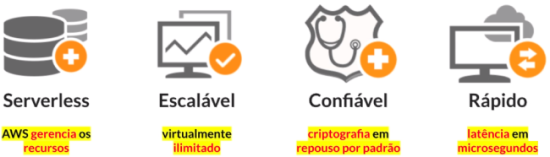

$\textcolor{salmon}{\textsf{Resumo:}}$ O Amazon DynamoDB é uma escolha poderosa para aplicativos que requerem escalabilidade rápida, baixa latência e flexibilidade de esquema. Sua natureza totalmente gerenciada remove a necessidade de preocupações operacionais, permitindo que os desenvolvedores se concentrem na criação de aplicativos inovadores.